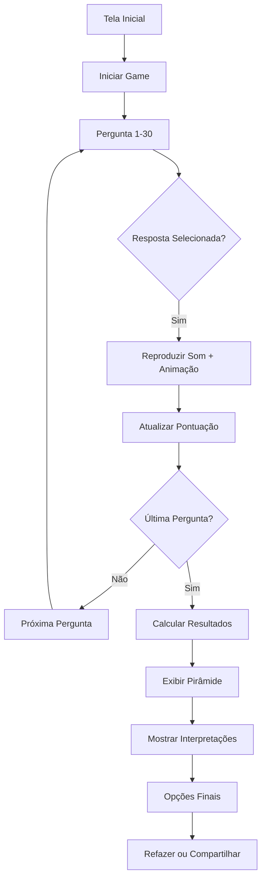

# 🎮 Super Mario Bros - Game da Pirâmide de Maslow 🎮

## 📖 Descrição

Este projeto é uma aplicação web interativa que combina a **Pirâmide de Maslow** com elementos visuais e sonoros inspirados no clássico jogo **Super Mario Bros**. O objetivo é criar uma experiência gamificada para avaliar as necessidades pessoais dos usuários baseada na hierarquia de necessidades humanas de Abraham Maslow.

## 🎯 Funcionalidades Principais

### 🧩 Sistema de Avaliação

- **30 perguntas** divididas em 5 categorias correspondentes aos níveis da Pirâmide de Maslow
- **Sistema de pontuação** estilo Mario Bros com coleta de moedas
- **Feedback visual e sonoro** para cada resposta
- **Barra de progresso** com indicadores de nível

### 🏗️ Os 5 Níveis da Pirâmide de Maslow

1. **🍄 Necessidades Fisiológicas** (6 perguntas)
   - Alimentação, sono, saúde, hidratação

2. **🛡️ Necessidades de Segurança** (6 perguntas)
   - Segurança física, estabilidade familiar, proteção

3. **❤️ Necessidades Sociais** (6 perguntas)
   - Relacionamentos, amizade, pertencimento, amor

4. **🏆 Necessidades de Estima** (6 perguntas)
   - Autoconfiança, reconhecimento, respeito, conquistas

5. **⭐ Necessidades de Autorrealização** (6 perguntas)
   - Crescimento pessoal, criatividade, propósito, potencial

### 🎮 Elementos Gamificados

- **Sistema de pontuação**: Cada resposta vale pontos (1-5 × 10)
- **Efeitos sonoros**: Sons inspirados no Mario Bros para ações do usuário
- **Animações**: Elementos flutuantes (moedas, power-ups)
- **Efeitos visuais**: Transições suaves e feedback visual

## 🏛️ Arquitetura do Código

### 📁 Estrutura de Arquivos

```text
/
├── index.html              # Estrutura principal da aplicação
├── styles.css              # Estilos principais
├── animations.css          # Animações CSS
├── data.js                 # Dados das perguntas e configurações
├── maslow-assessment.js    # Lógica principal da avaliação
├── ui.js                   # Gerenciador de interface (módulo principal)
├── ui-base-components.js   # Componentes base da UI
├── ui-components.js        # Componentes específicos da UI
├── ui-effects.js           # Efeitos visuais e animações
├── ui-results.js           # Exibição e interpretação dos resultados
└── audio.js                # Sistema de áudio e efeitos sonoros
```

### 🔄 Fluxo de Funcionamento



## 🧩 Módulos e Classes Principais

### 1. **MaslowAssessment** (maslow-assessment.js)

**Classe principal** que controla toda a lógica da avaliação:

```javascript
class MaslowAssessment {
    constructor() {
        this.currentQuestionIndex = 0;    // Pergunta atual
        this.answers = [];                // Respostas do usuário
        this.results = {};               // Resultados calculados
        this.score = 0;                  // Pontuação Mario-style
    }
    
    // Métodos principais:
    // - startGame(): Inicia o questionário
    // - showQuestion(): Exibe pergunta atual
    // - processAnswer(): Processa resposta do usuário
    // - calculateResults(): Calcula percentuais por nível
    // - showResults(): Exibe resultados finais
}
```

### 2. **UIManager** (ui.js)

**Gerenciador de interface** que coordena todos os componentes visuais:

```javascript
export class UIManager {
    constructor() {
        this.components = new UIComponents();    // Componentes base
        this.effects = new UIEffects();          // Efeitos visuais
        this.results = new UIResults();          // Resultados
    }
}
```

### 3. **Sistema de Áudio** (audio.js)

**Funções de áudio** para feedback sonoro:

```javascript
// Principais funções de áudio:
export function playTransitionSound()  // Som de transição
export function playLevelUpSound()     // Som de level up
export function playCoinSound()        // Som de moeda coletada
export function playCompletionSound()  // Som de conclusão
```

### 4. **Dados da Aplicação** (data.js)

**Estrutura de dados** com perguntas e configurações:

```javascript
export const questions = [
    { level: 1, text: "Pergunta sobre necessidades fisiológicas..." },
    // ... 30 perguntas totais
];

export const levelNames = {
    1: "Necessidades Fisiológicas",
    2: "Necessidades de Segurança",
    // ... etc
};
```

## ⚙️ Como Funciona

### 🚀 Inicialização

1. **Carregamento**: Todos os módulos são carregados via ES6 imports
2. **Setup**: Event listeners são configurados
3. **UI**: Interface inicial é exibida com animações

## 🔧 Funcionamento Detalhado do Código

### 📋 Estrutura de Dados

O aplicativo funciona com base em uma estrutura bem definida de dados:

```javascript
// data.js - Define todas as perguntas e configurações
export const questions = [
    { level: 1, text: "Pergunta sobre necessidades fisiológicas..." },
    { level: 2, text: "Pergunta sobre segurança..." },
    // ... 30 perguntas divididas em 5 níveis
];

export const levelNames = {
    1: "Necessidades Fisiológicas",
    2: "Necessidades de Segurança", 
    3: "Necessidades Sociais",
    4: "Necessidades de Estima",
    5: "Necessidades de Autorrealização"
};

export const levelColors = {
    1: '#FF6B35',  // Fisiológicas - Laranja
    2: '#F7931E',  // Segurança - Amarelo-laranja
    3: '#FFD23F',  // Sociais - Amarelo
    4: '#06FFA5',  // Estima - Verde
    5: '#4ECDC4'   // Autorrealização - Azul-verde
};
```

### 🏗️ Arquitetura Principal

#### 1. **Classe MaslowAssessment** (Controlador Principal)

```javascript
class MaslowAssessment {
    constructor() {
        this.currentQuestionIndex = 0;    // Controla pergunta atual (0-29)
        this.answers = [];                // Array com respostas [1,2,3,4,5]
        this.results = {};               // Resultados por nível {1: 85%, 2: 70%...}
        this.score = 0;                  // Pontuação total do jogador
        this.ui = new UIManager();       // Gerenciador de interface
    }
    
    // Ciclo principal do jogo:
    startGame() → showQuestion() → processAnswer() → calculateResults() → showResults()
}
```

**Fluxo de Execução:**

1. **startGame()**: Inicializa o questionário, mostra primeira pergunta
2. **showQuestion(index)**: Exibe pergunta específica com animações
3. **processAnswer(value)**: Processa resposta, adiciona pontos, avança
4. **calculateResults()**: Calcula percentuais por nível da pirâmide
5. **showResults()**: Exibe pirâmide final com interpretações

#### 2. **Sistema de UI Modular**

```javascript
// ui.js - Coordenador geral
export class UIManager {
    constructor() {
        this.components = new UIComponents();    // Elementos base
        this.effects = new UIEffects();          // Efeitos visuais
        this.results = new UIResults();          // Tela de resultados
    }
}

// ui-base-components.js - Elementos básicos
export class UIComponents {
    getElements() {
        return {
            gameContainer: document.getElementById('game-container'),
            introSection: document.getElementById('intro-section'),
            questionSection: document.getElementById('question-section'),
            // ... outros elementos
        };
    }
}

// ui-effects.js - Animações e efeitos
export class UIEffects {
    createPowerUpEffect(element) {
        // Cria animação de power-up no elemento
    }
    
    showSoundEffect(soundType) {
        // Reproduz efeito sonoro correspondente
    }
}
```

### 🎯 Sistema de Pontuação

```javascript
// Cada resposta vale pontos baseado no valor selecionado
document.addEventListener('change', (e) => {
    if (e.target.type === 'radio' && e.target.name === 'answer') {
        const answerValue = parseInt(e.target.value); // 1, 2, 3, 4 ou 5
        this.score += answerValue * 10;               // Multiplica por 10
        this.updateScoreDisplay();                    // Atualiza display
        audio.playCoinSound();                        // Som de moeda
    }
});

// Pontuação máxima possível: 30 perguntas × 5 pontos × 10 = 1500 pontos
```

### 📊 Cálculo dos Resultados

```javascript
calculateResults() {
    this.results = {};
    
    // Para cada nível da pirâmide (1-5)
    for (let level = 1; level <= 5; level++) {
        // Filtra perguntas do nível atual
        const levelQuestions = this.questions.filter(q => q.level === level);
        
        // Pega respostas correspondentes
        const levelAnswers = [];
        levelQuestions.forEach((question, index) => {
            const questionIndex = this.questions.indexOf(question);
            levelAnswers.push(this.answers[questionIndex]);
        });
        
        // Calcula percentual de satisfação
        const levelScore = levelAnswers.reduce((sum, answer) => sum + answer, 0);
        const maxPossible = levelAnswers.length * 5; // 6 perguntas × 5 pontos = 30
        const percentage = Math.round((levelScore / maxPossible) * 100);
        
        this.results[level] = {
            score: levelScore,      // Pontuação bruta (6-30)
            percentage: percentage, // Percentual (20-100%)
            maxPossible: maxPossible,
            interpretation: this.getInterpretation(level, percentage)
        };
    }
}
```

### 🎨 Sistema de Renderização da Pirâmide

```javascript
// ui-results.js
renderPyramid() {
    const pyramid = document.getElementById('pyramid-display');
    pyramid.innerHTML = '';
    
    // Renderiza cada nível da pirâmide (5 → 1, de cima para baixo)
    for (let level = 5; level >= 1; level--) {
        const levelData = this.results[level];
        const levelElement = document.createElement('div');
        
        levelElement.className = `pyramid-level level-${level}`;
        levelElement.style.backgroundColor = this.levelColors[level];
        levelElement.style.width = `${20 + (level * 16)}%`; // Largura proporcional
        
        levelElement.innerHTML = `
            <span class="level-name">${this.levelNames[level]}</span>
            <span class="level-percentage">${levelData.percentage}%</span>
        `;
        
        pyramid.appendChild(levelElement);
        
        // Animação de entrada com delay
        setTimeout(() => {
            levelElement.classList.add('visible');
        }, (5 - level) * 200);
    }
}
```

### 🔊 Sistema de Áudio

```javascript
// audio.js - Geração programática de sons
export function playCoinSound() {
    const audioContext = new (window.AudioContext || window.webkitAudioContext)();
    const oscillator = audioContext.createOscillator();
    const gainNode = audioContext.createGain();
    
    oscillator.connect(gainNode);
    gainNode.connect(audioContext.destination);
    
    // Frequências que imitam o som de moeda do Mario
    oscillator.frequency.setValueAtTime(1318.51, audioContext.currentTime);
    oscillator.frequency.setValueAtTime(1567.98, audioContext.currentTime + 0.1);
    
    gainNode.gain.setValueAtTime(0.3, audioContext.currentTime);
    gainNode.gain.exponentialRampToValueAtTime(0.01, audioContext.currentTime + 0.3);
    
    oscillator.start(audioContext.currentTime);
    oscillator.stop(audioContext.currentTime + 0.3);
}
```

### 🎮 Integração com Elementos Mario Bros

```javascript
// Elementos visuais flutuantes
createFloatingElements() {
    const gameContainer = document.getElementById('game-container');
    
    // Cria moedas flutuantes
    for (let i = 0; i < 5; i++) {
        const coin = document.createElement('div');
        coin.className = 'floating-coin';
        coin.innerHTML = '🪙';
        coin.style.left = Math.random() * 100 + '%';
        coin.style.animationDelay = Math.random() * 5 + 's';
        gameContainer.appendChild(coin);
    }
    
    // Cria power-ups flutuantes
    const powerUpEmojis = ['🍄', '🌟', '🔥', '⭐', '💎'];
    powerUpEmojis.forEach((emoji, index) => {
        const powerUp = document.createElement('div');
        powerUp.className = 'floating-powerup';
        powerUp.innerHTML = emoji;
        powerUp.style.right = (index * 20) + '%';
        powerUp.style.animationDelay = (index * 1.5) + 's';
        gameContainer.appendChild(powerUp);
    });
}
```

### 📱 Sistema de Responsividade

```css
/* styles.css - Design mobile-first */
.answer-option {
    display: flex;
    align-items: center;
    padding: 1rem;
    margin: 0.5rem 0;
    border-radius: 10px;
    min-height: 60px; /* Touch-friendly */
    transition: all 0.3s ease;
}

/* Tablet e desktop */
@media (min-width: 768px) {
    .answer-option {
        min-height: 50px;
        padding: 0.8rem;
    }
}

/* Desktop grande */
@media (min-width: 1024px) {
    .content-container {
        max-width: 800px;
        margin: 0 auto;
    }
}
```

### 🔄 Gerenciamento de Estado

```javascript
// Estado da aplicação é mantido na classe principal
class MaslowAssessment {
    constructor() {
        // Estado atual do jogo
        this.currentQuestionIndex = 0;  // Pergunta atual (0-29)
        this.answers = [];              // Respostas do usuário
        this.results = {};             // Resultados calculados
        this.isTransitioning = false;  // Previne cliques duplos
        this.score = 0;                // Pontuação total
    }
    
    // Métodos para atualizar estado
    updateState(newAnswerValue) {
        this.answers[this.currentQuestionIndex] = newAnswerValue;
        this.score += newAnswerValue * 10;
        this.currentQuestionIndex++;
        this.saveProgress(); // Salva no localStorage
    }
    
    // Persistência local
    saveProgress() {
        localStorage.setItem('maslow-progress', JSON.stringify({
            currentQuestion: this.currentQuestionIndex,
            answers: this.answers,
            score: this.score
        }));
    }
    
    loadProgress() {
        const saved = localStorage.getItem('maslow-progress');
        if (saved) {
            const data = JSON.parse(saved);
            this.currentQuestionIndex = data.currentQuestion;
            this.answers = data.answers;
            this.score = data.score;
        }
    }
}
```

### 🚀 Inicialização e Configuração

```javascript
// Ponto de entrada da aplicação
document.addEventListener('DOMContentLoaded', () => {
    // Instancia a aplicação principal
    const assessment = new MaslowAssessment();
    
    // Configura event listeners globais
    setupGlobalEventListeners();
    
    // Inicializa efeitos visuais
    initializeVisualEffects();
    
    // Carrega progresso salvo (se existir)
    assessment.loadProgress();
    
    // Ativa seção inicial
    assessment.ui.showSection('intro-section');
});

// Event listeners globais
function setupGlobalEventListeners() {
    // Previne zoom em inputs (mobile)
    document.addEventListener('touchstart', function(e) {
        if (e.touches.length > 1) {
            e.preventDefault();
        }
    });
    
    // Gerencia orientação da tela
    window.addEventListener('orientationchange', () => {
        setTimeout(() => {
            window.scrollTo(0, 0);
        }, 500);
    });
}
```

Este sistema modular permite fácil manutenção e extensão, mantendo a separação de responsabilidades entre lógica de negócio, interface do usuário, efeitos visuais e gerenciamento de dados.

---

**Desenvolvido com 💖 e inspirado no universo Mario Bros para tornar a psicologia mais divertida e acessível!**
**Created By BRUTECH®**
**Email: professordavi85@gmail.com**

---