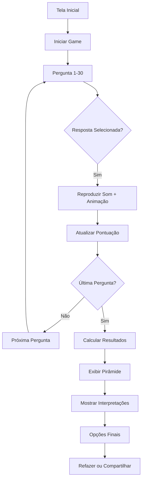

# 🎮 Super Mario Bros - Game da Pirâmide de Maslow 🎮

## 📖 Descrição

Este projeto é uma aplicação web interativa que combina a **Pirâmide de Maslow** com elementos visuais e sonoros inspirados no clássico jogo **Super Mario Bros**. O objetivo é criar uma experiência gamificada para avaliar as necessidades pessoais dos usuários baseada na hierarquia de necessidades humanas de Abraham Maslow.

## 🎯 Funcionalidades Principais

### 🧩 Sistema de Avaliação

- **30 perguntas** divididas em 5 categorias correspondentes aos níveis da Pirâmide de Maslow
- **Sistema de pontuação** estilo Mario Bros com coleta de moedas
- **Feedback visual e sonoro** para cada resposta
- **Barra de progresso** com indicadores de nível

### 🏗️ Os 5 Níveis da Pirâmide de Maslow

1. **🍄 Necessidades Fisiológicas** (6 perguntas)
   - Alimentação, sono, saúde, hidratação

2. **🛡️ Necessidades de Segurança** (6 perguntas)
   - Segurança física, estabilidade familiar, proteção

3. **❤️ Necessidades Sociais** (6 perguntas)
   - Relacionamentos, amizade, pertencimento, amor

4. **🏆 Necessidades de Estima** (6 perguntas)
   - Autoconfiança, reconhecimento, respeito, conquistas

5. **⭐ Necessidades de Autorrealização** (6 perguntas)
   - Crescimento pessoal, criatividade, propósito, potencial

### 🎮 Elementos Gamificados

- **Sistema de pontuação**: Cada resposta vale pontos (1-5 × 10)
- **Efeitos sonoros**: Sons inspirados no Mario Bros para ações do usuário
- **Animações**: Elementos flutuantes (moedas, power-ups)
- **Efeitos visuais**: Transições suaves e feedback visual

## 🏛️ Arquitetura do Código

### 📁 Estrutura de Arquivos

```text
/
├── index.html              # Estrutura principal da aplicação
├── styles.css              # Estilos principais
├── animations.css          # Animações CSS
├── data.js                 # Dados das perguntas e configurações
├── maslow-assessment.js    # Lógica principal da avaliação
├── ui.js                   # Gerenciador de interface (módulo principal)
├── ui-base-components.js   # Componentes base da UI
├── ui-components.js        # Componentes específicos da UI
├── ui-effects.js           # Efeitos visuais e animações
├── ui-results.js           # Exibição e interpretação dos resultados
└── audio.js                # Sistema de áudio e efeitos sonoros
```

### 🔄 Fluxo de Funcionamento



## 🧩 Módulos e Classes Principais

### 1. **MaslowAssessment** (maslow-assessment.js)

**Classe principal** que controla toda a lógica da avaliação:

```javascript
class MaslowAssessment {
    constructor() {
        this.currentQuestionIndex = 0;    // Pergunta atual
        this.answers = [];                // Respostas do usuário
        this.results = {};               // Resultados calculados
        this.score = 0;                  // Pontuação Mario-style
    }
    
    // Métodos principais:
    // - startGame(): Inicia o questionário
    // - showQuestion(): Exibe pergunta atual
    // - processAnswer(): Processa resposta do usuário
    // - calculateResults(): Calcula percentuais por nível
    // - showResults(): Exibe resultados finais
}
```

### 2. **UIManager** (ui.js)

**Gerenciador de interface** que coordena todos os componentes visuais:

```javascript
export class UIManager {
    constructor() {
        this.components = new UIComponents();    // Componentes base
        this.effects = new UIEffects();          // Efeitos visuais
        this.results = new UIResults();          // Resultados
    }
}
```

### 3. **Sistema de Áudio** (audio.js)

**Funções de áudio** para feedback sonoro:

```javascript
// Principais funções de áudio:
export function playTransitionSound()  // Som de transição
export function playLevelUpSound()     // Som de level up
export function playCoinSound()        // Som de moeda coletada
export function playCompletionSound()  // Som de conclusão
```

### 4. **Dados da Aplicação** (data.js)

**Estrutura de dados** com perguntas e configurações:

```javascript
export const questions = [
    { level: 1, text: "Pergunta sobre necessidades fisiológicas..." },
    // ... 30 perguntas totais
];

export const levelNames = {
    1: "Necessidades Fisiológicas",
    2: "Necessidades de Segurança",
    // ... etc
};
```

## ⚙️ Como Funciona

### 🚀 Inicialização

1. **Carregamento**: Todos os módulos são carregados via ES6 imports
2. **Setup**: Event listeners são configurados
3. **UI**: Interface inicial é exibida com animações

### 📝 Durante o Questionário

1. **Exibição**: Pergunta atual é mostrada com animações
2. **Interação**: Usuário seleciona resposta (1-5 escala Likert)
3. **Feedback**: Sons e efeitos visuais são reproduzidos
4. **Pontuação**: Score é atualizado (valor da resposta × 10)
5. **Progressão**: Barra de progresso e contador são atualizados

### 📊 Cálculo dos Resultados

```javascript
// Para cada nível da pirâmide:
const levelScore = levelAnswers.reduce((sum, answer) => sum + answer, 0);
const maxPossible = levelAnswers.length * 5; // Máximo possível
const percentage = (levelScore / maxPossible) * 100;
```

### 🎨 Visualização da Pirâmide

- **Representação visual**: Pirâmide com 5 níveis coloridos
- **Percentuais**: Cada nível mostra sua porcentagem de satisfação
- **Interpretações**: Texto explicativo para cada nível baseado no resultado

### 📤 Funcionalidades Avançadas

- **Compartilhamento**: Geração de imagem/texto dos resultados
- **Integração GitHub**: Envio opcional de resultados para repositório
- **Responsividade**: Adaptação para dispositivos móveis

## 🎮 Experiência do Usuário

### 🔊 Feedback Sonoro

- **Coin Sound**: Ao selecionar resposta
- **Power-up Sound**: Ao completar nível
- **Jump Sound**: Navegação entre seções
- **Completion Sound**: Finalização do questionário

### ✨ Efeitos Visuais

- **Animações CSS**: Transições suaves entre elementos
- **Floating Elements**: Moedas e power-ups flutuantes
- **Progress Effects**: Celebração visual ao atingir marcos
- **Color Coding**: Cada nível tem cor específica

### 📱 Responsividade

- **Mobile-first**: Otimizado para dispositivos móveis
- **Touch-friendly**: Botões grandes para toque
- **Viewport adaptivo**: Ajuste automático do layout

## 🛠️ Tecnologias Utilizadas

- **HTML5**: Estrutura semântica
- **CSS3**: Estilos, animações e responsividade
- **JavaScript ES6+**: Módulos, classes e funcionalidades modernas
- **Web Audio API**: Geração de sons programaticamente
- **CSS Grid/Flexbox**: Layout responsivo
- **CSS Animations**: Efeitos visuais fluidos

## 🚀 Como Executar

1. **Clone o repositório**
2. **Abra o index.html** em um navegador moderno
3. **Certifique-se** de que os arquivos estão no mesmo diretório
4. **Interaja** com a aplicação clicando em "Começar Game"

## 🎯 Personalização

### 🔧 Configurações Ajustáveis

No arquivo `maslow-assessment.js`, existem comentários `@tweakable` indicando valores que podem ser facilmente modificados:

```javascript
/* @tweakable GitHub repository owner/username */
this.githubOwner = 'your-username';

/* @tweakable GitHub repository name */
this.githubRepo = 'maslow-results';
```

### 🎨 Temas e Cores

As cores dos níveis podem ser modificadas no arquivo `data.js`:

```javascript
export const levelColors = {
    1: '#FF6B35',  // Fisiológicas - Laranja
    2: '#F7931E',  // Segurança - Amarelo-laranja
    3: '#FFD23F',  // Sociais - Amarelo
    4: '#06FFA5',  // Estima - Verde
    5: '#4ECDC4'   // Autorrealização - Azul-verde
};
```

---

**Desenvolvido com 💖 e inspirado no universo Mario Bros para tornar a psicologia mais divertida e acessível!**